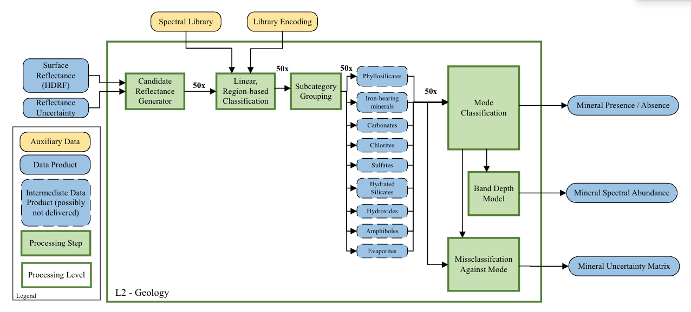

**SBG VSWIR Geology Products – Algorithm Theoretical Basis Document (ATBD)**

**R.O. Green**1
**P.G. Brodrick**1

1Jet Propulsion Laboratory, California Institute of Technology

Corresponding author: Robert O. Green (robert.o.green@jpl.nasa.gov)

**Key Points:**

- Collection of surface identification algorithms to support the SBG VSWIR geology suite

**Version:** 1.0

**Release Date:** TBD

**DOI:** TBD

# Abstract

# Plain Language Summary

## Keywords: snow fractional cover, snow grain size, snow albedo

# 1 Version Description

This is Version 1.0 of the SBG VSWIR geology algorithms.

# 2 Introduction

# 3 Context/Background

## 3.1 Historical Perspective

The SBG Geology algorithm suite will build off a long heritage of retrievals, drawing off of and improving on algorithms established for use with AVIRIS, AVIRIS-NG, and especially EMIT.

## 3.2 Additional Information

# 4 Algorithm Description

**Figure 1.** _Map of snow physics SRR core product algorithms._

## 4.1 Multiple Endmember Snow Cover and Grain Size (MEMSCAG)

### 4.1.1 Scientific theory

### 4.1.1.1 Scientific theory assumptions

### 4.1.2 Mathematical theory

### 4.1.3 Algorithm Input Variables

### 4.1.4 Algorithm Output Variables

### 4.2.1.1 Scientific theory assumptions

### 4.2.2 Mathematical theory

### 4.2.2.1 Mathematical theory assumptions

### 4.2.3 Algorithm Input Variables

### 4.2.4 Algorithm Output Variables

## 4.3 Algorithm Input Variables

## 4.4 Algorithm Output Variables

# 5 Algorithm Usage Constraints

# 6 Performance Assessment

## 6.1 Validation Methods

## 6.2 Uncertainties

## 6.3 Validation Errors

# 7 Algorithm Implementation

## 7.1 Algorithm Availability

## 7.2 Input Data Access

## 7.3 Output Data Access

## 7.4 Important Related URLs

# 8 Significance Discussion

# 9 Open Research

# 10 Acknowledgements

# 11 Contact Details

# References
